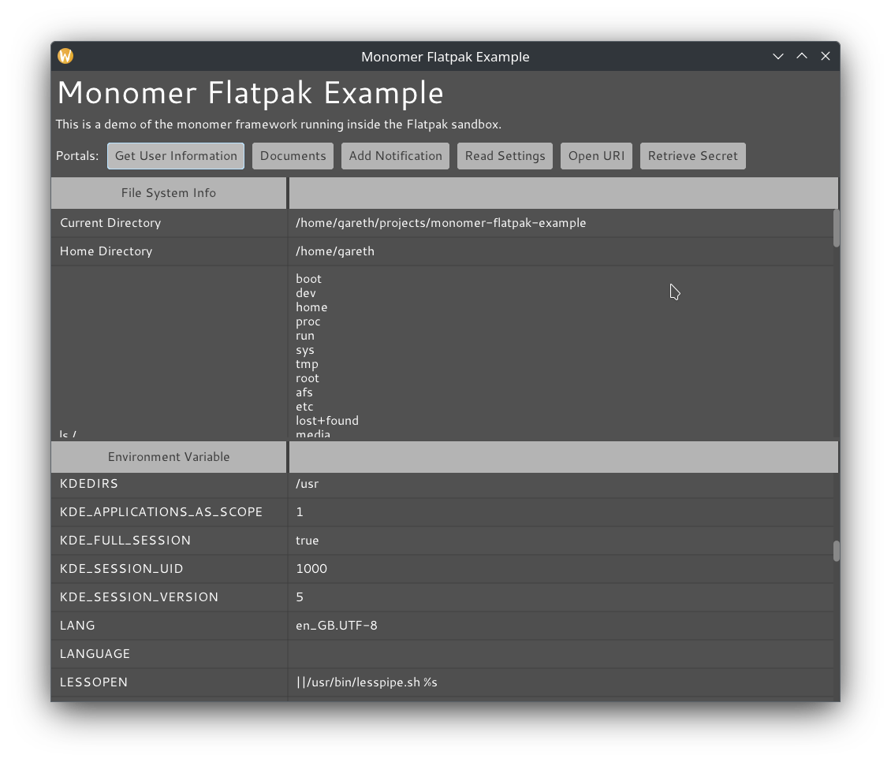

# Flatpak Monomer Example

A demonstration of the [Monomer](https://github.com/fjvallarino/monomer) framework running inside [Flatpak](https://flatpak.org/).

Flatpak provides a relatively easy way to deploy apps on Linux, using a standard package format that works on any supported Linux distrubution. It has runtime sandboxing and a "portals" system for access to the underlying operating system: this promises to be particularly useful for Monomer, because it provides things like file choosers that Monomer does not have natively.

The Flatpak manifest generated for this app builds everything from source. This is necessary to distribute the app on Flathub. If you don't care about Flathub and just want to distribute a standalone Flatpak with a binary executable inside it, then a [Flatpak app bundle](https://linuxconfig.org/an-introduction-to-flatpak-app-bundles) might be easier.



## Current Status
The basic app is working as a Flatpak and has also been published onto [Flathub](https://flathub.org/apps/details/io.github.Dretch.MonomerFlatpakExample). The app includes a basic portals demo.

## How It Works
- A patched version of [cabal-flatpak](https://hub.darcs.net/Dretch/cabal-flatpak) is used to generate the basic Flatpak manifest. 
- Then an extra build step is injected that installs metadata files needed by Flathub.
- The process is automated in [generate-manifest.sh](flatpak/generate-manifest.sh), and is also setup to run via [a Github action](.github/workflows/generate-flatpak-manifest.yml).
- The generated manifest can then be tested locally:
    ```bash
    FLATPAK=~/flatpak

    # build the flatpak manifest and install into a local repository
    flatpak-builder --force-clean --repo=$FLATPAK/repository --state-dir=$FLATPAK/builder/ $FLATPAK/build/io.github.Dretch.MonomerFlatpakExample flatpak/io.github.Dretch.MonomerFlatpakExample.yml

    # point our local flatpak at our local repository, and install the app from it
    flatpak --user remote-add --no-gpg-verify home-repository $FLATPAK/repository
    flatpak --user --reinstall install home-repository io.github.Dretch.MonomerFlatpakExample

    # finally run the app
    flatpak run io.github.Dretch.MonomerFlatpakExample
    ```
- You can also publish on Flathub, by following [the normal process](https://github.com/flathub/flathub/wiki/App-Submission).

## Portals
The [XDG Desktop Portals APIs](https://flatpak.github.io/xdg-desktop-portal) allow reading/writing files, accessing microphones/webcams, opening URIs, printing, etc. This app includes some buttons to demonstrate basic portal functionality (provided via the [desktop-portal](https://github.com/Dretch/haskell-desktop-portal) library).

## FAQs
- **Q. How to load fonts/images within the app?**
- **A.** Use [the normal Cabal mechanism](https://neilmitchell.blogspot.com/2008/02/adding-data-files-using-cabal.html) (for example, see how the fonts are loaded in this app).
- **Q. How to install an application launcher for the app?**
- **Q.** Put a [.desktop file](assets/io.github.Dretch.MonomerFlatpakExample.desktop) and [icon file](assets/io.github.Dretch.MonomerFlatpakExample.png) into your Cabal package and then install them into the right place in the Flatpak using an extra build step (see build step injection in  [generate-manifest.sh](flatpak/generate-manifest.sh)).
- **Q. How to install AppStream (app store) metadata?**
- **A.** This can be done just like the desktop file, see [this app](assets) for an example.
- **Q. Why do we need a patched cabal-flatpak?**
- **A.** The patches make cabal-flatpak include library executables (alex, happy, c2hs) into the Flatpak manifest. The author will try and get this change upstreamed.
- **Q. Can portals be tested without building the Flatpak?**
- **A.** Yes! The portal APIs work from regular executables, so long as Flatpak is installed.

## Gotchas
- Flatpak is Linux only, whereas Monomer itself also works on Windows and MacOS.
- This process requires your application (not just the libraries it depends on) to be published on Hackage - this might not be something you would otherwise bother with. Changes to `cabal-flatpak` could in theory avoid this requirement - since Flatpak could pull directly from Git tags rather than from Hackage.
- All the libraries your app needs must be on Hackage too. Again in theory you could use Git to work around this.
- If any of the Haskell libraries your app depends on are building executables, these will be included in the Flatpak too, increasing the size. You will probably need to add the executables to `cleanup` to avoid this (see [the manifest template for this example](flatpak/io.github.Dretch.MonomerFlatpakExample.template.yml)).
- Building the Flatpak the first time is really slow. Subsequent builds will be a bit faster, though.
- This project is currently x86_64 only, because the author lacks any other machines to test on (if you can test on other architectures, please open an issue/PR).

## Development Guide
### To format the source code
```bash
# This needs at least ormolu 0.5.0.0 to avoid breaking dot-record syntax
ormolu --mode inplace $(find . -name '*.hs')
```